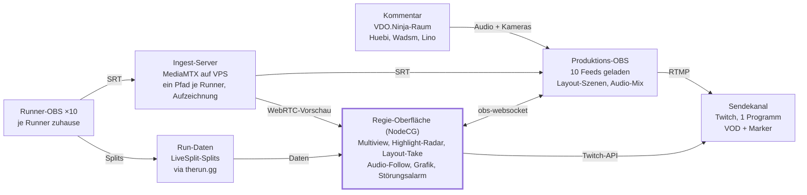

# ueBroadcast

Regie-Oberfläche für Multi-Stream-Events, gekoppelt mit OBS. Erster Anwendungsfall: **„Mario 64 Marathon“** – ca. 10 Remote-Runner, 5 Tage, täglich 12–22 Uhr, Super Mario 64 (70 Stars), Host Huebi mit Wadsm und Lino.

> Technisches Konzept, Stand 09.10.2026 – Tobias Lindner

## Ausgangslage & Ziele

Empfehlung: Ein einziges Produktions-OBS, gesteuert über eine browserbasierte Regie-Oberfläche (NodeCG + obs-websocket), die aus 10 Remote-Feeds die spannendsten Momente automatisch vorschlägt. So kann eine Person die Bildregie über 10 Stunden am Tag halten, ohne Highlights zu verpassen.

| Eckdaten          | Stand                                            |
| ----------------- | ------------------------------------------------ |
| Spiel / Kategorie | Super Mario 64, 70 Stars                         |
| Runner            | ca. 10, alle remote von zuhause                  |
| Zeitraum          | ca. 5 Tage im Dezember 2026                      |
| Sendezeit         | täglich ca. 12–22 Uhr, also rund 50 Stunden live |
| Host & Kommentar  | Huebi, mit Wadsm und Lino                        |
| Sendekanal        | noch offen (vermutlich Huebis Twitch)            |

Ein 70-Star-Run dauert grob 45 Minuten bis über eine Stunde, dazu kommen Resets. Bei 10 parallelen Runnern passiert also fast immer irgendwo etwas – die Kernaufgabe der Regie ist Auswählen, nicht Suchen.

**Ziele**

- Eine Bildregie-Person behält alle 10 Feeds im Blick und schneidet mit wenigen Klicks.
- Zuschauer sehen PB-Versuche, Endphasen und knappe Duelle live statt im Nachhinein.
- Runner brauchen nur ihr normales OBS plus eine zusätzliche Ausgabe.
- Der Betrieb hält 5 Tage am Stück stabil, mit klaren Fallbacks bei Feed- oder Leitungsausfall.

## Systemarchitektur

Die Runner-Feeds laufen über den Ingest-Server ins Produktions-OBS; die Regie-Oberfläche sieht alle Feeds als Vorschau, bekommt die Run-Daten und steuert OBS sowie Twitch – ein Programm geht raus.

## Signal-Ingest der Runner-Feeds

Empfehlung: Jeder Runner schickt sein Bild per SRT an einen eigenen Ingest-Server (Variante A); das Abgreifen vom Twitch-Kanal des Runners bleibt der Notfall-Weg.

| Variante                     | Weg                                     | Latenz (ca.) | Qualität                     | Aufwand Runner                      | Bewertung                 |
| ---------------------------- | --------------------------------------- | ------------ | ---------------------------- | ----------------------------------- | ------------------------- |
| A: SRT-Push an Ingest-Server | Runner-OBS → MediaMTX → Produktions-OBS | 1–2 s        | volle Kontrolle über Bitrate | eine zusätzliche Ausgabe einrichten | Empfehlung                |
| B: Pull vom Runner-Twitch    | Twitch → Streamlink → Produktions-OBS   | 5–15 s       | Twitch-Transcode, schwankend | keiner                              | Fallback                  |
| C: VDO.Ninja (WebRTC)        | Browser-Link → Browserquelle in OBS     | < 1 s        | bei Bewegung oft unscharf    | gering                              | nur für Kameras/Kommentar |

**Details zu Variante A**

- Ingest-Server: MediaMTX auf einem kleinen VPS (z. B. Frankfurt). Jeder Runner bekommt einen eigenen Pfad mit Passwort. Der VPS entkoppelt die Runner vom Studio-Anschluss.
- Streamt der Runner nur für uns, reicht OBS nativ (benutzerdefinierter Server). Will er parallel auf seinem eigenen Kanal senden, braucht er ein Multi-Output-Plugin (z. B. obs-multi-rtmp oder Aitum Multistream).
- Vorgabe für alle: 1280×720, 60 fps, ca. 4–6 Mbit/s, Keyframe-Intervall 1–2 s, 4:3-Spielbild zentriert. SM64 hat ohnehin eine niedrige native Auflösung; 1080p bringt kaum etwas.
- MediaMTX stellt jeden Feed zusätzlich als WebRTC-Vorschau bereit. Diese speist die Multiview der Regie-Oberfläche – mit geringerer Verzögerung als das Programm.
- MediaMTX zeichnet jeden Feed auf. Das ist Sicherung, Material für Highlights und Basis für Replays (Phase 2).

**Latenz und Sync**

Solange die Runner nicht gleichzeitig auf Kommando starten, ist eine Verzögerung von 1–2 s unkritisch. Wichtig ist nur, dass Kommentar und Regie dasselbe Bild sehen wie das Programm – sie schauen deshalb auf die Multiview bzw. den Programm-Rückweg, nie auf Twitch.

## Die Regie-Oberfläche: Module und Features

Die Oberfläche läuft im Browser (Tablet, zweiter Monitor, Laptop) und spricht über obs-websocket v5 direkt mit dem Produktions-OBS. Basis ist NodeCG, das Framework, mit dem auch große Speedrun-Marathons ihre Grafiken und Dashboards bauen; das Bundle nodecg-speedcontrol bringt Runner-Daten, Zeitplan und Twitch-Anbindung schon mit.

| Modul                     | Was es tut                                                                                               | Priorität      |
| ------------------------- | -------------------------------------------------------------------------------------------------------- | -------------- |
| Multiview mit Feed-Status | Kachel je Runner: Live-Bild (WebRTC), Sterne x/70, Split-Delta zur PB, Bitrate, Ampel für Verbindung     | Muss           |
| Highlight-Radar           | Sortiert die Runner nach Spannung und meldet Momente aktiv (siehe unten)                                 | Muss           |
| Layout-Take               | Layout wählen (1, 2, 4, alle 10, Host-Cam), Runner per Klick in Slots ziehen, Preview → Take             | Muss           |
| Audio-Follow              | Spielton folgt automatisch dem Runner im Hauptslot; Ducking unter Kommentar                              | Muss           |
| Störungs-Handling         | Alarm bei Feed-Abbruch; fällt der Hauptfeed aus, automatischer Wechsel auf Ersatzlayout                  | Muss           |
| Grafik-Steuerung          | Bauchbinden, Tagestabelle, Leaderboard, Ticker ein- und ausblenden                                       | Soll           |
| Twitch-Anbindung          | Titel setzen, Stream-Marker bei Highlights, Umfragen und Predictions („Wer schafft heute die Bestzeit?“) | Soll           |
| Runner-Check-in           | Runner melden sich an/ab; Regie sieht, wer gerade live ist und wer nur pausiert                          | Soll           |
| Hardware-Tasten           | Stream Deck über Bitfocus Companion für Take, Layouts, Audio                                             | Soll           |
| Replay                    | „Letzte 30 s von Runner X“ aus der MediaMTX-Aufzeichnung einspielen                                      | Kann (Phase 2) |
| Runner-Interview          | Runner nach PB per VDO.Ninja kurz zuschalten                                                             | Kann           |

### Highlight-Radar

Das Radar vergibt jedem aktiven Run laufend eine Punktzahl. Die Regie sieht eine sortierte Liste plus Push-Hinweise wie „Runner X auf PB-Pace, noch 8 Sterne“.

- **PB-Pace:** Delta zur persönlichen Bestzeit negativ → viele Punkte, je später im Run, desto mehr.
- **Endphase:** ab ca. Stern 60 bzw. Bowser in the Sky steigt die Punktzahl stark.
- **Duelle:** zwei Runner mit ähnlicher Zeit am gleichen Punkt → Vorschlag für ein 2er-Layout.
- **Resets:** Run abgebrochen → Punktzahl fällt, Kachel wird ausgegraut.
- **Lange nicht gezeigt:** wer lange nicht im Bild war, bekommt einen kleinen Bonus – damit alle 10 Runner Sendezeit bekommen.

Das Radar schlägt vor, die Regie entscheidet. Ein optionaler Auto-Modus kann in ruhigen Phasen (etwa wenn die Regie Pause macht) selbst schneiden.

### Technik hinter dem Layout-Take

- Alle 10 Feeds sind dauerhaft als Medienquellen in einer versteckten Szene „Feeds“ geladen. Die Layout-Szenen binden sie nur ein. Ein Umschnitt lädt also nichts nach und ist sofort sauber.
- Die Oberfläche setzt per obs-websocket, welcher Feed in welchem Slot sichtbar ist, und löst dann den Übergang im Studio-Modus aus.
- Namen, Timer und Sterne-Zähler im Slot kommen aus NodeCG und wandern automatisch mit dem Runner mit.

## Run-Daten & Overlays

Ohne Live-Daten aus den Splits funktionieren weder Radar noch Overlays – deshalb gilt: alle Runner nutzen LiveSplit mit einer vorgegebenen, einheitlichen Split-Datei.

**Datenquelle**

1. **therun.gg (bevorzugt):** Runner installieren die therun.gg-Komponente in LiveSplit. Splits, Delta und PB-Pace laufen live zu therun.gg und können von dort abgefragt werden. Vorher prüfen: Datenzugriff und Nutzungsbedingungen.
2. **Eigenes Split-Relay (Fallback):** ein kleines Tool beim Runner liest den lokalen LiveSplit-Server und schickt die Splits ausgehend an unseren Server. Keine Portfreigabe beim Runner nötig.
3. **Manuell:** eine Hilfsperson pflegt Sterne-Stände per Klick. Für 10 Runner über 50 Stunden nur als Notlösung.

Einheitliche Splits sind der entscheidende Punkt: Splitten Runner unterschiedlich (pro Level, pro Stern, nur Bowser), lassen sich Sterne-Zähler und Vergleiche nicht sauber berechnen. Empfehlung: Split pro Stern-Gruppe bzw. Level mit hinterlegter Sternzahl, vorab mit allen Runnern abgestimmt.

**Overlays (Browserquellen aus NodeCG)**

- Runner-Kachel: Name, Sterne x/70, Timer, Delta zur PB, kleiner Status (läuft / Reset / Pause).
- Tagestabelle: beste Zeit, Anzahl beendeter Runs, gesammelte Sterne je Runner.
- Event-Leaderboard über alle 5 Tage – Wertung hängt vom noch offenen Modus ab.
- Hinweis-Band „Gleich spannend“: zeigt Zuschauern, wer kurz vor dem Ziel ist.
- Host-Rahmen für Huebi, Wadsm und Lino mit Namen.

Abgeschlossene Runs landen in einer kleinen Datenbank. Daraus entstehen Tagesstatistiken, Rekordmeldungen („neue Event-Bestzeit!“) und Material für Social Media.

## Kommentar & Audio

Empfehlung: Huebi, Wadsm und Lino kommen über einen VDO.Ninja-Raum ins Produktions-OBS – jede Person als eigene Quelle mit eigener Kamera und eigener Tonspur.

- **Getrennte Spuren:** Jede Stimme lässt sich einzeln pegeln, komprimieren und bei Störungen stummschalten. Für den VOD-Schnitt werden alle Spuren getrennt mitgeschnitten.
- **Sehen, was gesendet wird:** Das Kommentarteam schaut auf die Multiview bzw. einen Programm-Rückweg mit geringer Verzögerung, nie auf Twitch.
- **Talkback:** Ein eigener Kanal (z. B. Discord oder VDO.Ninja-Regieton) von der Regie nur auf ein Ohr des Hosts – für Hinweise wie „Runner 4 gleich bei Bowser“.
- **Mischung im OBS:** Spielton des Hauptslots unter dem Kommentar abgesenkt (Ducking), Limiter auf der Summe, Ziel ca. −14 LUFS für Twitch.
- **Huebi vor Ort im eigenen Studio:** Falls er dort mit eigener Technik sitzt, kann er alternativ einen fertigen Kommentar-Mix schicken. Das spart Aufwand, nimmt der Regie aber die Kontrolle über einzelne Stimmen.
- **Runner-Ton:** Standardmäßig nur Spielton. Runner-Mikros nur für Interviews zuschalten, damit Absprachen mit Familie oder Discord nicht versehentlich auf Sendung gehen.

Bei 10 Stunden pro Tag sollte das Kommentarteam rotieren; die Grafik zeigt immer, wer gerade spricht.

## Tech-Stack, Hardware & Betrieb

Der Stack besteht fast nur aus bewährter Open-Source-Software; eigene Entwicklung fällt vor allem für Highlight-Radar, Layout-Take und Split-Anbindung an.

| Komponente      | Empfehlung                                         | Zweck                                      |
| --------------- | -------------------------------------------------- | ------------------------------------------ |
| Produktion      | OBS Studio (aktuelle Version) mit obs-websocket v5 | Bild, Ton, Ausspielung an Twitch           |
| Regie & Grafik  | NodeCG + nodecg-speedcontrol, eigene Bundles       | Oberfläche, Overlays, Run-Daten            |
| Ingest          | MediaMTX auf VPS                                   | SRT-Empfang, WebRTC-Vorschau, Aufzeichnung |
| Fallback-Ingest | Streamlink                                         | Feeds vom Runner-Twitch abgreifen          |
| Kommentar       | VDO.Ninja                                          | Kameras und Ton des Kommentarteams         |
| Run-Daten       | LiveSplit + therun.gg oder eigenes Relay           | Splits, Delta, Sterne                      |
| Bedienung       | Bitfocus Companion + Stream Deck                   | Tasten für Take, Layouts, Audio            |
| Plattform       | Twitch-API                                         | Titel, Marker, Umfragen, Predictions       |

**Hardware (Richtwerte)**

- Produktions-PC: aktuelle 8–12-Kern-CPU, NVIDIA-GPU mit NVENC und Hardware-Decoding, 32 GB RAM. 10 gleichzeitig dekodierte 720p-Feeds sind damit machbar, müssen aber vorab unter Volllast getestet werden.
- Regieplatz: 3 Monitore (Programm, Multiview/Regie-Oberfläche, Audio/Status) plus Stream Deck.
- Leitung im Studio: Download ca. 50–60 Mbit/s für 10 Feeds plus Reserve, Upload mindestens 10–15 Mbit/s für Twitch und Rückwege.

**Betrieb über 5 Tage**

- Tagesablauf: 11:00 Technik-Check mit allen Runnern, 12:00 On Air, 22:00 Ende, danach Aufzeichnungen sichern und Rechner neu starten.
- Redundanz: USV am Regieplatz, zweite Internetleitung (z. B. 5G-Router) als Fallback, Ersatz-PC mit identischer Szenen-Sammlung, lokale Aufnahme des Programms.
- Pausen-Slate mit Tabelle und Musik, falls kurzfristig niemand läuft.
- Logbuch der Regie: Störungen und Highlights mit Uhrzeit – erleichtert VOD-Schnitt und Nachbereitung.

## Rollen, Umsetzungsplan & offene Fragen

Für den Live-Betrieb reichen drei Rollen; bei 10 Stunden am Tag sollten Bildregie und Technik sich abwechseln können.

| Rolle                    | Aufgabe                                                     |
| ------------------------ | ----------------------------------------------------------- |
| Bildregie                | Layouts, Takes, Grafiken – arbeitet mit dem Highlight-Radar |
| Technik & Runner-Support | Feeds, Ton, Störungen, Kontakt zu den Runnern per Discord   |
| Host & Kommentar         | Huebi mit Wadsm und Lino, Moderation, Interviews            |

**Umsetzungsplan (rückwärts vom Eventstart)**

1. Ca. 8 Wochen vorher: Format, Wertung und Runner festlegen; Split-Datei und Technik-Vorgaben an alle Runner.
2. Ca. 6 Wochen vorher: Ingest-Server und OBS-Grundgerüst stehen; erste Testfeeds von 2–3 Runnern.
3. Ca. 4 Wochen vorher: Regie-Oberfläche mit Multiview, Layout-Take, Audio-Follow; Overlays in erster Version.
4. Ca. 2 Wochen vorher: Highlight-Radar, Split-Anbindung, Twitch-Anbindung; Einzel-Technik-Check mit jedem Runner.
5. Ca. 1 Woche vorher: Generalprobe über mehrere Stunden mit allen 10 Feeds und dem Kommentarteam, Lasttest des Produktions-PCs.
6. Event: tägliche Checks, Logbuch, Nachbesserungen über Nacht.

**Offene Fragen**

- [ ] Genaue Termine im Dezember und Anzahl der Tage?
- [ ] Wertungsmodus: beste Zeit, Anzahl beendeter Runs, Gesamt-Sterne – oder Mischung?
- [ ] Streamen die Runner parallel auf eigenen Kanälen, und haben alle dem Restream zugestimmt?
- [ ] Spielen die Runner auf Konsole oder Emulator, und nutzen alle LiveSplit?
- [ ] Sitzt Huebi im eigenen Studio, sind Wadsm und Lino remote?
- [ ] Über welchen Kanal wird gesendet – und gibt es Spenden oder einen Charity-Zweck?
- [ ] Wer übernimmt Bildregie und Technik, und welches Budget steht für Entwicklung und Betrieb bereit?
